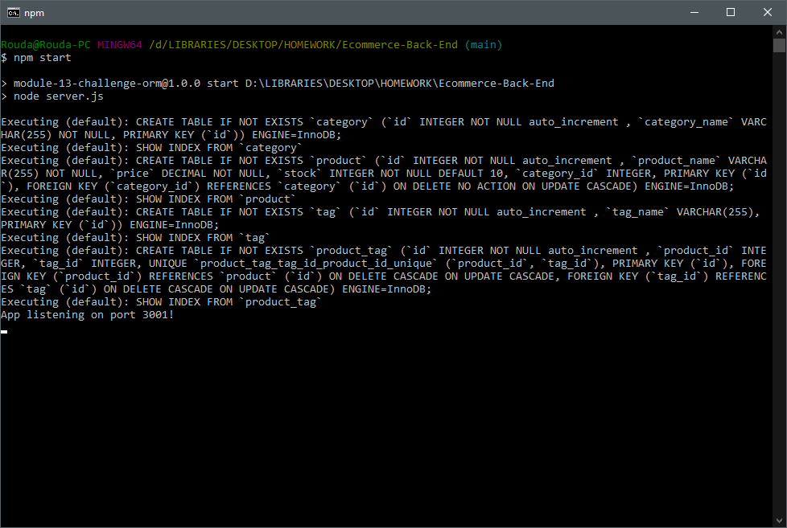
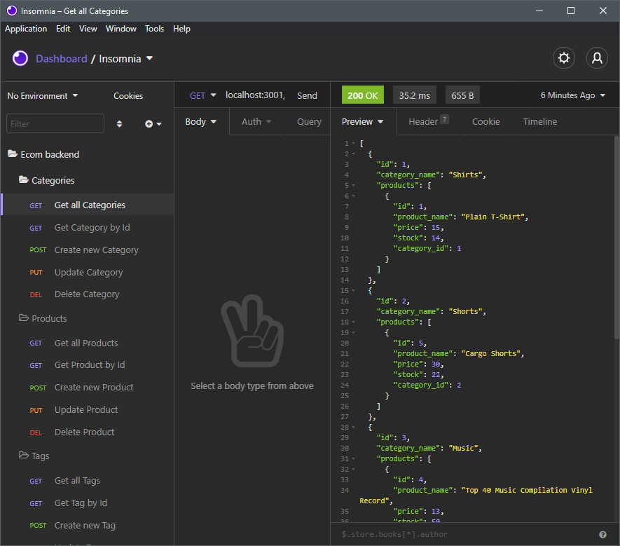

# Ecommerce-Back-End
## An application to manage an online store's inventory

## Description:

## Table of Contents:
[User Story](#User-Story) 
[Installation](#Installation) 
[Usage](#Usage) 
[Tests](#Tests) 
[Contributions](#Contributions) 
[Contact](#Contact) 
[License](#License) 

## User Story:
- AS A manager at an internet retail company
- I WANT a back end for my e-commerce website that uses the latest technologies
- SO THAT my company can compete with other e-commerce companies

## Installation:
If you want to use or develop this application locally, clone the repository and install dependencies by running `npm i` in your terminal in the root folder. 
The MySQL connection uses a `.env` to hold a password. Create a `.env` file or replace with field in `config/connection.js` with a hardcoded password. 

## Usage:
View 1: 
 
View 2: 
 

## Tests:
No tests are currently included.

## Contributions:
Technologies used include JavaScript, Node.js, MySQL2, Express, and Sequelize.

## Contact:
Check out my [Github](https://github.com/MonsAltus). 
Email me at <hacklander.dev@gmail.com>

## License:
Covered under the [MIT License](https://github.com/MonsAltus//Ecommerce-Back-End/blob/main/LICENSE).
